---
## Front matter
title: "Лабораторная работа №2"
subtitle: "Архитектура внутренних систем"
author: "Ежова Алиса Михайловна"

## Generic otions
lang: ru-RU
toc-title: "Содержание"

## Bibliography
bibliography: bib/cite.bib
csl: pandoc/csl/gost-r-7-0-5-2008-numeric.csl

## Pdf output format
toc: true # Table of contents
toc-depth: 2
lof: true # List of figures
fontsize: 12pt
linestretch: 1.5
papersize: a4
documentclass: scrreprt
## I18n polyglossia
polyglossia-lang:
  name: russian
  options:
	- spelling=modern
	- babelshorthands=true
polyglossia-otherlangs:
  name: english
## I18n babel
babel-lang: russian
babel-otherlangs: english
## Fonts
mainfont: PT Serif
romanfont: PT Serif
sansfont: PT Sans
monofont: PT Mono
mainfontoptions: Ligatures=TeX
romanfontoptions: Ligatures=TeX
sansfontoptions: Ligatures=TeX,Scale=MatchLowercase
monofontoptions: Scale=MatchLowercase,Scale=0.9
## Biblatex
biblatex: true
biblio-style: "gost-numeric"
biblatexoptions:
  - parentracker=true
  - backend=biber
  - hyperref=auto
  - language=auto
  - autolang=other*
  - citestyle=gost-numeric
## Pandoc-crossref LaTeX customization
figureTitle: "Рис."
tableTitle: "Таблица"
listingTitle: "Листинг"
lofTitle: "Список иллюстраций"
lolTitle: "Листинги"
## Misc options
indent: true
header-includes:
  - \usepackage{indentfirst}
  - \usepackage{float} # keep figures where there are in the text
  - \floatplacement{figure}{H} # keep figures where there are in the text
---

# Цель работы

Изучить идеологию и применение средств контроля версий. Приобрести практические навыки по работе с системой git.

# Задание

1. Создайте отчет по выполнению лабораторной работы в соответствующем
каталоге рабочего пространства (labs>lab03>report).
2. Скопируйте отчеты по выполнению предыдущих лабораторных работ в
соответствующие каталоги созданного рабочего пространства.
3. Загрузите файлы на github.

# Выполнение лабораторной работы

Описываются проведённые действия, в качестве иллюстрации даётся ссылка на иллюстрацию (рис. [-@fig:001])

2.4.1. Настройка github
1.  Создадим учетную запись в сервере Github и заполним основные данные:

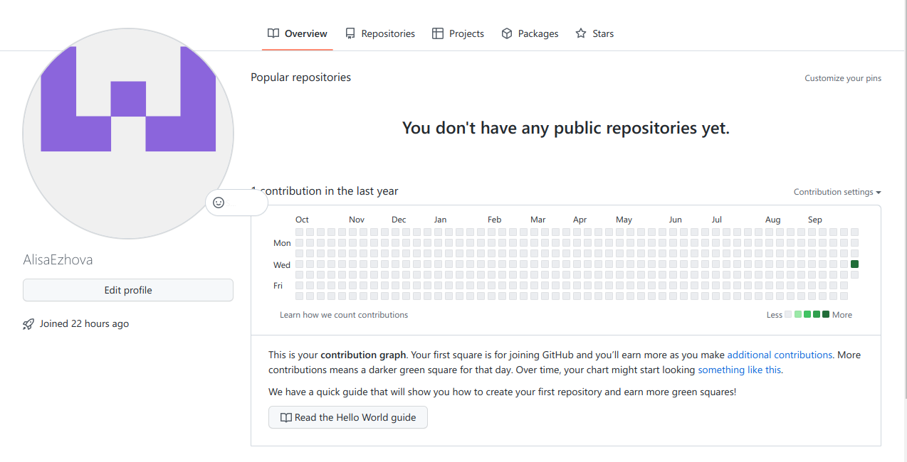{ #fig:001 width=90% }

2.4.2. Базовая настройка git
1. Сделаем предварительную конфигурацию “git”, укажем имя и email владельца:

{ #fig:002 width=90% }

2. Настроим “utf-8” в выводе сообщений “git”:

{ #fig:003 width=90% }

3. Зададим имя начальной ветки, назовем её “master”:

{ #fig:004 width=90% }

Параметр autocrlf:

{ #fig:005 width=90% }

Параметр safecrlf:

{ #fig:006 width=90% }

2.4.3. Создание SSH ключа
1. Сгенерируем пару ключей, необходимых для идентификации пользователя на сервере репозиториев:

{ #fig:007 width=90% }

2. Скопировали из локальной консоли ключ в буфер обмена:

{ #fig:008 width=90% }

Вставляем ключ в появившееся на сайте поле и указываем для ключа им “Title”:

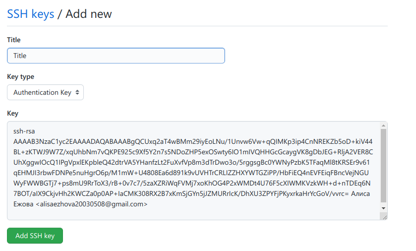{ #fig:009 width=90% }

2.4.4. Создание рабочего пространства и репозитория курса на основе шаблона
1. Создадим каталог для педмета “Архитектура компьютера”:

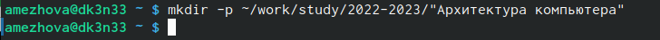{ #fig:010 width=90% }

2.4.5. Создание репозитория курса на основе шаблона
1. Перейдем на страницу репозитория с шаблоном курса и выберем 
“Use this template”:

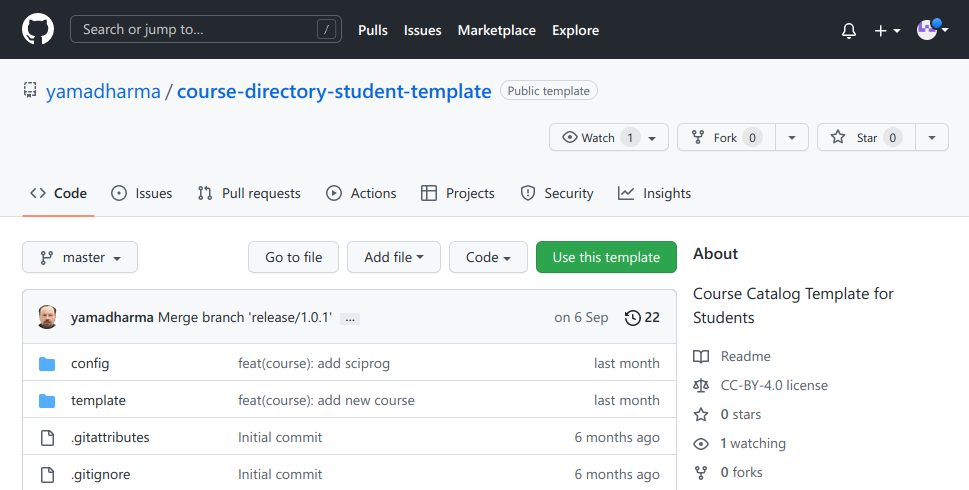{ #fig:011 width=90% }

2. Зададим имя репозитория “study_2022-2023_arh-pc” и создадим его:

{ #fig:012 width=90% }

3. Откроем терминал и перейдем в каталог курса:

{ #fig:013 width=90% }

4. Клонируем созданный репозиторий:

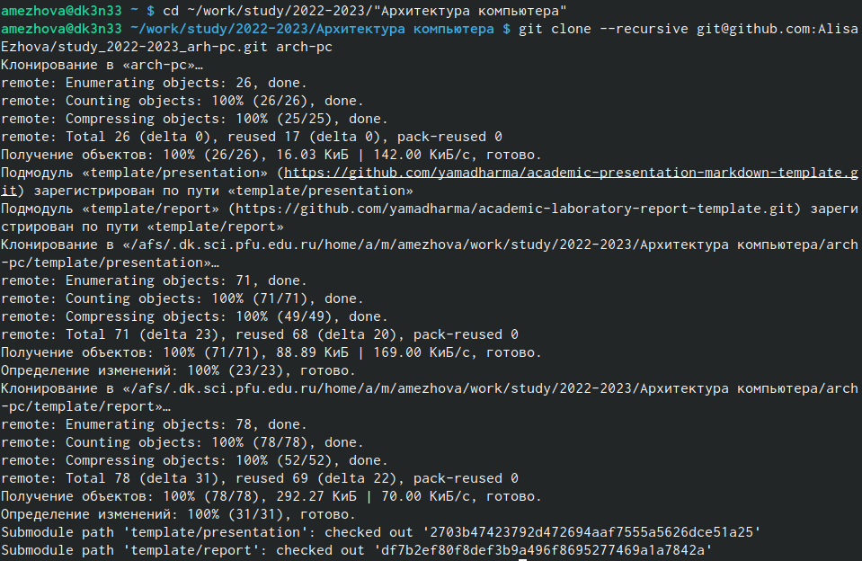{ #fig:014 width=90% }

2.4.6. Настройка каталога курса
1. Перейдем в каталог курса:

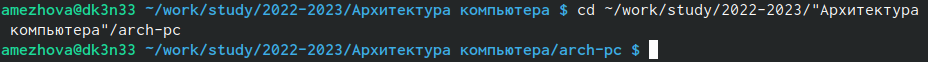{ #fig:015 width=90% }

2. Удалим лишние файлы:

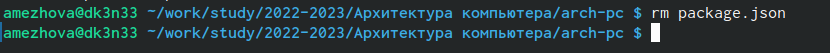{ #fig:016 width=90% }

3. Создадим необходимые каталоги:

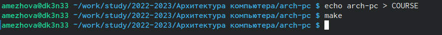{ #fig:017 width=90% }

4. Отправим файлы на сервер:

{ #fig:018 width=90% }

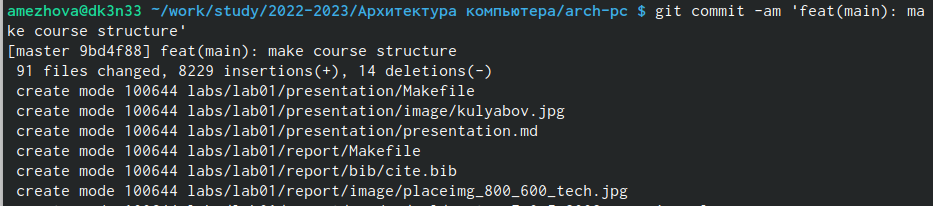{ #fig:019 width=90% }

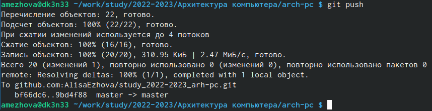{ #fig:020 width=90% }

5. Порверим правильность создания иерархии рабочего прострнства в локальном репозитории и на странице github:

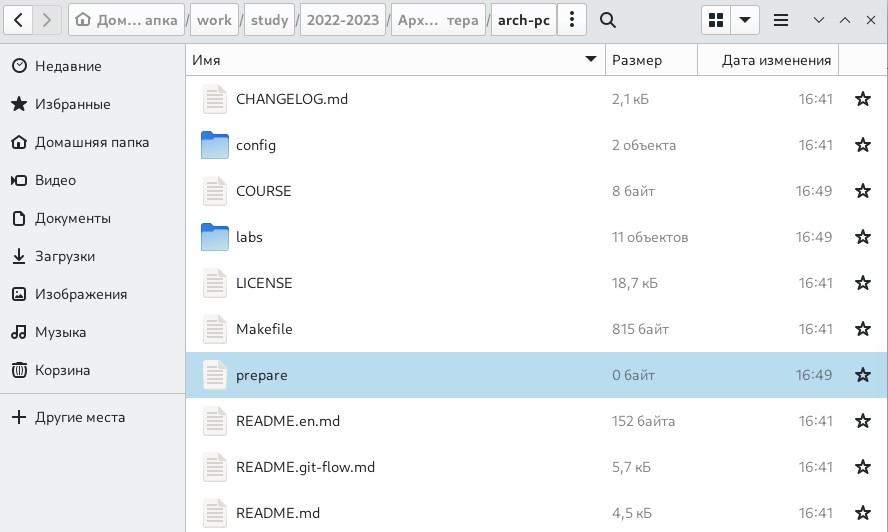{ #fig:021 width=90% }

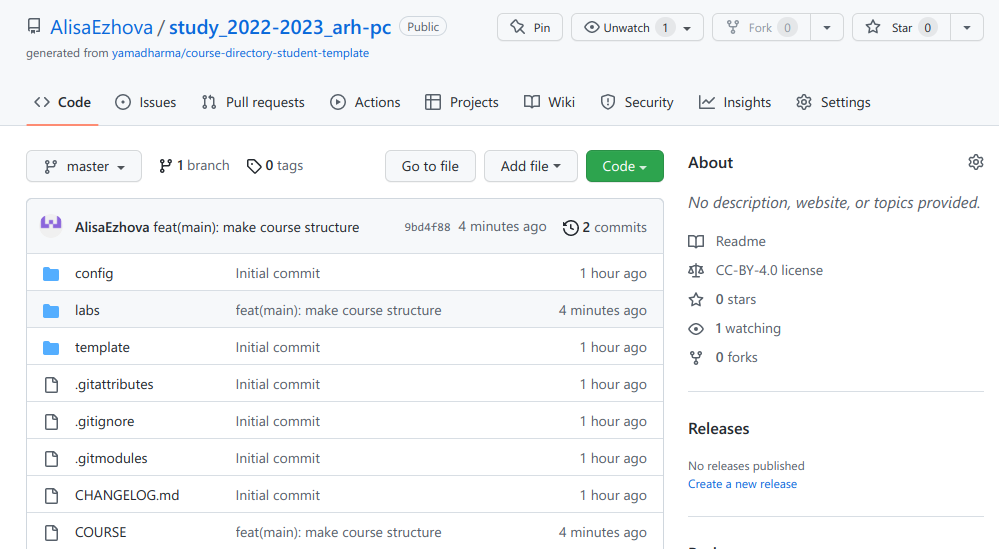{ #fig:022 width=90% }

# Выводы

В ходе выполнения лабораторной работы №2 я изучила идеологию и применила средства контроля версий. Приобрела практические навыки по работе с системой git.

::: {#refs}
:::
