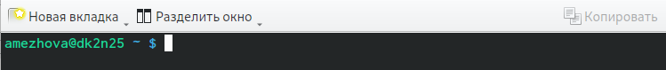
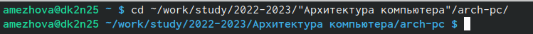
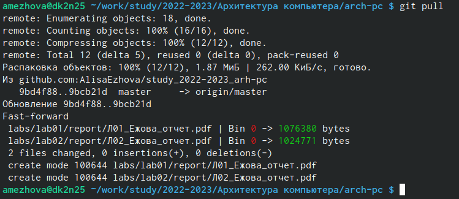
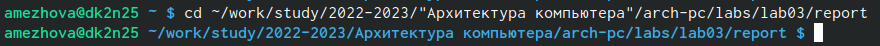
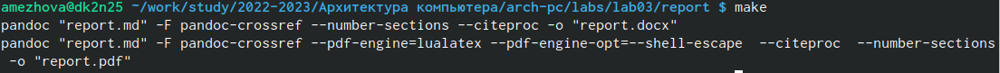
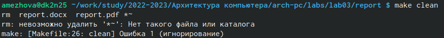
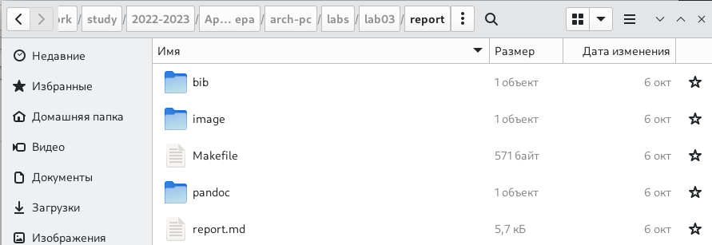
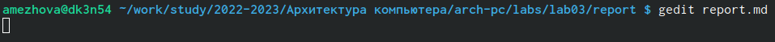
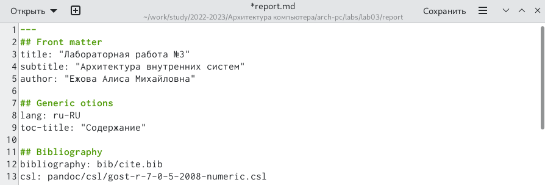

---
## Front matter
title: "Лабораторная работа №3"
subtitle: "Архитектура внутренних систем"
author: "Ежова Алиса Михайловна"

## Generic otions
lang: ru-RU
toc-title: "Содержание"

## Bibliography
bibliography: bib/cite.bib
csl: pandoc/csl/gost-r-7-0-5-2008-numeric.csl

## Pdf output format
toc: true # Table of contents
toc-depth: 2
lof: true # List of figures
fontsize: 12pt
linestretch: 1.5
papersize: a4
documentclass: scrreprt
## I18n polyglossia
polyglossia-lang:
  name: russian
  options:
	- spelling=modern
	- babelshorthands=true
polyglossia-otherlangs:
  name: english
## I18n babel
babel-lang: russian
babel-otherlangs: english
## Fonts
mainfont: PT Serif
romanfont: PT Serif
sansfont: PT Sans
monofont: PT Mono
mainfontoptions: Ligatures=TeX
romanfontoptions: Ligatures=TeX
sansfontoptions: Ligatures=TeX,Scale=MatchLowercase
monofontoptions: Scale=MatchLowercase,Scale=0.9
## Biblatex
biblatex: true
biblio-style: "gost-numeric"
biblatexoptions:
  - parentracker=true
  - backend=biber
  - hyperref=auto
  - language=auto
  - autolang=other*
  - citestyle=gost-numeric
## Pandoc-crossref LaTeX customization
figureTitle: "Рис."
tableTitle: "Таблица"
listingTitle: "Листинг"
lofTitle: "Список иллюстраций"
lolTitle: "Листинги"
## Misc options
indent: true
header-includes:
  - \usepackage{indentfirst}
  - \usepackage{float} # keep figures where there are in the text
  - \floatplacement{figure}{H} # keep figures where there are in the text
---

# Цель работы

Целью работы является освоение процедуры оформления отчетов с помощью
легковесного языка разметки Markdown.

# Задание

1. В соответствующем каталоге сделайте отчёт по лабораторной работе № 3
в формате Markdown. В качестве отчёта необходимо предоставить отчёты
в 3 форматах: pdf, docx и md.
2. Загрузите файлы на github.

# Выполнение лабораторной работы

1) Откроем терминал:

{ #fig:001 width=90% }

2) Перейдем в каталог курса сформированный при выполнении лабораторной работы №2:

{ #fig:002 width=90% }

Обновим локальный репозиторий, скачав изменения из удаленного репозитория с помощью команды “git pull”:

{ #fig:003 width=90% }

3) Перейдем в каталог с шаблоном отчета по лабораторной работы №3:

{ #fig:004 width=90% }

4) Проведем компиляцию шаблона с использованием “Makefile”. Для этого введем команду “make”:

{ #fig:005 width=90% }

Проверим корректность полученных файлов:

{ #fig:006 width=90% }

5) Удалим полученные файлы с использованием “Makefile”. Для этого введем команду команду “make clean”:

{ #fig:007 width=90% }

Проверим, что после этой команды файлы “report.pdf” и “report.docx” удалены:

{ #fig:008 width=90% }

6) Откроем файл “report.md” с помощью любого текстового редактора, например “getit”:

{ #fig:009 width=90% }

7) Заполним отчет и скомпилируем отчет с использованием Makefile. Проверим корректность полученных файлов. 

{ #fig:010 width=90% }

8) Загрузим все файлы на Github.

# Выводы

В ходе лабораторной работы №3 освоила процедуры оформления отчетов с помощью легковесного языка разметки Markdown: оформление изображений, генерирование файлов и компелирование отчета.

::: {#refs}
:::
