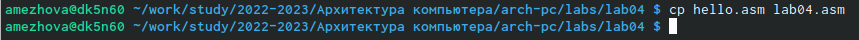

---
## Front matter
title: "Лабораторная работа №4"
subtitle: "Архитектура внутренних систем"
author: "Ежова Алиса Михайловна"

## Generic otions
lang: ru-RU
toc-title: "Содержание"

## Bibliography
bibliography: bib/cite.bib
csl: pandoc/csl/gost-r-7-0-5-2008-numeric.csl

## Pdf output format
toc: true # Table of contents
toc-depth: 2
lof: true # List of figures
fontsize: 12pt
linestretch: 1.5
papersize: a4
documentclass: scrreprt
## I18n polyglossia
polyglossia-lang:
  name: russian
  options:
	- spelling=modern
	- babelshorthands=true
polyglossia-otherlangs:
  name: english
## I18n babel
babel-lang: russian
babel-otherlangs: english
## Fonts
mainfont: PT Serif
romanfont: PT Serif
sansfont: PT Sans
monofont: PT Mono
mainfontoptions: Ligatures=TeX
romanfontoptions: Ligatures=TeX
sansfontoptions: Ligatures=TeX,Scale=MatchLowercase
monofontoptions: Scale=MatchLowercase,Scale=0.9
## Biblatex
biblatex: true
biblio-style: "gost-numeric"
biblatexoptions:
  - parentracker=true
  - backend=biber
  - hyperref=auto
  - language=auto
  - autolang=other*
  - citestyle=gost-numeric
## Pandoc-crossref LaTeX customization
figureTitle: "Рис."
tableTitle: "Таблица"
listingTitle: "Листинг"
lofTitle: "Список иллюстраций"
lolTitle: "Листинги"
## Misc options
indent: true
header-includes:
  - \usepackage{indentfirst}
  - \usepackage{float} # keep figures where there are in the text
  - \floatplacement{figure}{H} # keep figures where there are in the text
---

# Цель работы

Освоение процедуры компиляции и сборки программ, написанных на ассемблере NASM.

# Задание

1. В каталоге ~/work/arch-pc/lab04 с помощью команды cp создайте копию
файла hello.asm с именем lab04.asm
2. С помощью любого текстового редактора внесите изменения в текст программы в файле lab04.asm так, чтобы вместо Hello world! на экран выводилась строка с вашими фамилией и именем.
3. Оттранслируйте полученный текст программы lab04.asm в объектный
файл. Выполните компоновку объектного файла и запустите получившийся исполняемый файл.
4. Скопируйте файлы hello.asm и lab04.asm в Ваш локальный репозиторий
в каталог ~/work/study/2022-2023/"Архитектура компьютера"/archpc/labs/lab04/. Загрузите файлы на Github.

# Выполнение лабораторной работы

1) Рассмотрим пример простой программы на языке ассемблера NASM. Создадим каталог для работы с программами на языке ассемблера NASM (уже существует):

{ #fig:001 width=90% }

2) Перейдем в созданный каталог:

{ #fig:002 width=90% }

3) Создадим текстовый файл с именем hello.asm:

{ #fig:003 width=90% }

4) Откроем этот файл с помощью любого текстового редактора, например, getit:

{ #fig:004 width=90% }

и введем в него следующий текст:

{ #fig:005 width=90% }

5) Напишем, необходимый для компиляции приведенного выше текст программы “Hello World”:

{ #fig:006 width=90% }

6) С помощью команды ls проверим, что объектный файл был создан:

{ #fig:007 width=90% }

7) Выполним следующую команду:

{ #fig:008 width=90% }

8) С помощью команды ls проверим, что файлы были созданы:

{ #fig:009 width=90% }

9) Чтобы получить исполняемую программу, объектный файл необходимо передать на обработку компоновщику:

{ #fig:010 width=90% }

10) С помощью команды ls проверим, что исполняемый файл hello был создан:

{ #fig:011 width=90% }

11) Выполним следующую команду:

{ #fig:012 width=90% }

12) Формат командной строки LD можно увидеть, набрав ld –help:

{ #fig:013 width=90% }

13) Запустим на выполнение созданный исполняемый файл, находящийся в текущем каталоге, набрав в командной строке:

{ #fig:014 width=90% }

14) В каталоге ~/work/study/2022-2023/"Архитектура компьютера"/arch-pc/labs/labs04 с помощью команды cp создала копию файла hello.asm с именем lab4.asm:

{ #fig:015 width=90% }

15) С помощью любого текстового редактора внесла изменения в текст программы в файле lab4.asm так, чтобы вместо Hello world! на экран выводилась строка с вашими фамилией и имеем:

{ #fig:016 width=90% }

16) Оттранслировала полученный текст программы lab04.asm в объектный файл. Выполнила компоновку объектного файла и запустила получившийся исполняемый файл:

{ #fig:017 width=90% }

17) Загрузила файлы Github.

# Вывод

Я освоила процедуру компиляции и сборки программ, написанных на ассемблере NASM.
