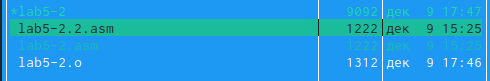

---
## Front matter
title: "Лабораторная работа №5"
subtitle: "Архитектура вычислительных систем"
author: "Ежова Алиса Михайловна"

## Generic otions
lang: ru-RU
toc-title: "Содержание"

## Bibliography
bibliography: bib/cite.bib
csl: pandoc/csl/gost-r-7-0-5-2008-numeric.csl

## Pdf output format
toc: true # Table of contents
toc-depth: 2
lof: true # List of figures
fontsize: 12pt
linestretch: 1.5
papersize: a4
documentclass: scrreprt
## I18n polyglossia
polyglossia-lang:
  name: russian
  options:
	- spelling=modern
	- babelshorthands=true
polyglossia-otherlangs:
  name: english
## I18n babel
babel-lang: russian
babel-otherlangs: english
## Fonts
mainfont: PT Serif
romanfont: PT Serif
sansfont: PT Sans
monofont: PT Mono
mainfontoptions: Ligatures=TeX
romanfontoptions: Ligatures=TeX
sansfontoptions: Ligatures=TeX,Scale=MatchLowercase
monofontoptions: Scale=MatchLowercase,Scale=0.9
## Biblatex
biblatex: true
biblio-style: "gost-numeric"
biblatexoptions:
  - parentracker=true
  - backend=biber
  - hyperref=auto
  - language=auto
  - autolang=other*
  - citestyle=gost-numeric
## Pandoc-crossref LaTeX customization
figureTitle: "Рис."
tableTitle: "Таблица"
listingTitle: "Листинг"
lofTitle: "Список иллюстраций"
lotTitle: "Список таблиц"
lolTitle: "Листинги"
## Misc options
indent: true
header-includes:
  - \usepackage{indentfirst}
  - \usepackage{float} # keep figures where there are in the text
  - \floatplacement{figure}{H} # keep figures where there are in the text
---

# Цель работы

Приобретение практических навыков работы в Midnight Commander. Освоение
инструкций языка ассемблера mov и int.

# Задание

1. Создайте копию файла lab6-1.asm. Внесите изменения в программу (без
использования внешнего файла in_out.asm), так чтобы она работала по
следующему алгоритму:
• вывести приглашение типа “Введите строку:”;
• ввести строку с клавиатуры;
• вывести введённую строку на экран.
2. Получите исполняемый файл и проверьте его работу. На приглашение
ввести строку введите свою фамилию.
3. Создайте копию файла lab6-2.asm. Исправьте текст программы с использование подпрограмм из внешнего файла in_out.asm, так чтобы она работала по следующему алгоритму:
• вывести приглашение типа “Введите строку:”;
• ввести строку с клавиатуры;
• вывести введённую строку на экран.

# Выполнение лабораторной работы

1) Откроем  Midnight Commander:

{ #fig:001 width=90% }

2) Пользуясь клавишами ↑ , ↓ и Enter перейдите в каталог:

{ #fig:002 width=90% }

3) Пользуясь строкой ввода и командой touch создадим файл lab5-1.asm:

{ #fig:003 width=90% }

4) С помощью функциональной клавиши F4 откроем файл lab5-1.asm для редактирования во встроенном редакторе:

{ #fig:004 width=90% }

5) Введем текст программы из листинга 6.1, сохраним изменения и закроем файл:

{ #fig:005 width=90% }

6) С помощью функциональной клавиши F3 откроем файл lab5-1.asm для
просмотра. Убедимся, что файл содержит текст программы:

{ #fig:006 width=90% }

{ #fig:007 width=90% }

7) Оттранслируем текст программы lab5-1.asm в объектный файл. Выполним компоновку объектного файла и запустим получившийся исполняемый файл. Программа выводит строку 'Введите строку:' и ожидает ввода с клавиатуры. На запрос введем ФИО:

{ #fig:008 width=90% }

8) Скачаем файл in_out.asm со страницы курса в ТУИС.

9) В одной из панелей mc откроем каталог с файлом lab5-1.asm. В другой панели каталог со скаченным файлом in_out.asm. Скопируем файл in_out.asm в каталог с файлом lab6-1.asm с помощью функциональной клавиши F5:

{ #fig:009 width=90% }

10) С помощью функциональной клавиши F6 создадим копию файла lab5-1.asm с именем lab5-2.asm. Выделим файл lab5-1.asm, нажмем клавишу F6 , введем имя файла lab6-2.asm и нажмем клавишу Enter:

{ #fig:010 width=90% }

11) Исправим текст программы в файле lab5-2.asm с использование подпрограмм из внешнего файла in_out.asm (используйте подпрограммы sprintLF, sread и quit) в соответствии с листингом 6.2:

{ #fig:011 width=90% }

12) В файле lab5-2.asm заменим подпрограмму sprintLF на sprint. Создадим исполняемый файл и проверим его работу.

{ #fig:012 width=90% }

Разница в том, что при замене подпрограммы sprintLF на sprint текст выводится на той же строке, где расположены фраза "Введите строку", а не на отдельной:

{ #fig:013 width=90% }

# Выполнение самостоятельной работы

1) Создала копию файла lab5-1.asm. Внесла изменения в программу (без использования внешнего файла in_out.asm), так чтобы она работала по следующему алгоритму:
• вывести приглашение типа “Введите строку:”;
• ввести строку с клавиатуры;
• вывести введённую строку на экран.

{ #fig:014 width=90% }

{ #fig:015 width=90% }

2) Создала копию файла lab5-2.asm. Исправила текст программы с использованием подпрограмм из внешнего файла in_out.asm

{ #fig:016 width=90% }

{ #fig:017 width=90% }

# Вывод

В ходе выполнения лабораторной работы №5 я приобрела практические навыки работы в Midnight Commander. Также, освоила инструкции языка ассемблера mov и int.
