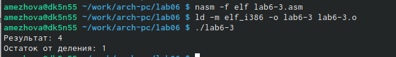

---
## Front matter
title: "Лабораторная работа №6"
subtitle: "Архитектура вычислительных систем"
author: "Ежова Алиса Михайловна"

## Generic otions
lang: ru-RU
toc-title: "Содержание"

## Bibliography
bibliography: bib/cite.bib
csl: pandoc/csl/gost-r-7-0-5-2008-numeric.csl

## Pdf output format
toc: true # Table of contents
toc-depth: 2
lof: true # List of figures
fontsize: 12pt
linestretch: 1.5
papersize: a4
documentclass: scrreprt
## I18n polyglossia
polyglossia-lang:
  name: russian
  options:
	- spelling=modern
	- babelshorthands=true
polyglossia-otherlangs:
  name: english
## I18n babel
babel-lang: russian
babel-otherlangs: english
## Fonts
mainfont: PT Serif
romanfont: PT Serif
sansfont: PT Sans
monofont: PT Mono
mainfontoptions: Ligatures=TeX
romanfontoptions: Ligatures=TeX
sansfontoptions: Ligatures=TeX,Scale=MatchLowercase
monofontoptions: Scale=MatchLowercase,Scale=0.9
## Biblatex
biblatex: true
biblio-style: "gost-numeric"
biblatexoptions:
  - parentracker=true
  - backend=biber
  - hyperref=auto
  - language=auto
  - autolang=other*
  - citestyle=gost-numeric
## Pandoc-crossref LaTeX customization
figureTitle: "Рис."
tableTitle: "Таблица"
listingTitle: "Листинг"
lofTitle: "Список иллюстраций"
lolTitle: "Листинги"
## Misc options
indent: true
header-includes:
  - \usepackage{indentfirst}
  - \usepackage{float} # keep figures where there are in the text
  - \floatplacement{figure}{H} # keep figures where there are in the text
---

# Цель работы

Освоение арифметических инструкций языка ассемблера NASM

# Задание

1. Написать программу вычисления выражения y = f(x). Программа должна
выводить выражение для вычисления, выводить запрос на ввод значения x, вычислять заданное выражение в зависимости от введенного x, выводить результат вычислений. Вид функции f(x) выбрать из таблицы 6.3 вариантов заданий в соответствии с номером полученным при выполнении лабораторной работы. Создайте исполняемый файл и проверьте его работу для значений x1 и x2 из 6.3.

# Выполнение лабораторной работы

1) Создадим каталог для программам лабораторной работы № 6, перейдите в
него и создайте файл lab6-1.asm:

{ #fig:001 width=90% }

2) Рассмотрим примеры программ вывода символьных и численных значений. Программы будут выводить значения записанные в регистр eax. Введем в файл lab6-1.asm текст программы из листинга 7.1.:

{ #fig:002 width=90% }

Создадим исполняемый файл и запустим его:

{ #fig:003 width=90% }

3) Далее изменим текст программы и вместо символов, запишем в регистры числа. Исправим текст программы (Листинг 1):

{ #fig:004 width=90% }

Создадим исполняемый файл и запустим его:

{ #fig:005 width=90% }

4) Преобразуем текст программы из Листинга 7.1 с использованием функций. Создадим файл lab6-2.asm в каталоге ~/work/arch-pc/lab06 и введем в него текст программы из листинга 7.2.:

{ #fig:006 width=90% }

{ #fig:007 width=90% }

Создадим исполняемый файл и запустим его:

{ #fig:008 width=90% }

5) Аналогично предыдущему примеру изменим символы на числа:

{ #fig:009 width=90% }

Создадим исполняемый файл и запустим его:

{ #fig:010 width=90% }

Заменим функцию iprintLF на iprint:

{ #fig:011 width=90% }

Создадим исполняемый файл и запустим его:

{ #fig:012 width=90% }

6) В качестве примера выполнения арифметических операций в NASM приведем программу вычисления арифметического выражения f(x) = (5 * 2 +3)/3. Создадим файл lab6-3.asm в каталоге ~/work/arch-pc/lab06:

{ #fig:013 width=90% }

Внимательно изучим текст программы из листинга 7.3 и введем в lab6-3.asm:

{ #fig:014 width=90% }

Создадим исполняемый файл и запустим его:

{ #fig:015 width=90% }

Изменим текст программы для вычисления выражения f(x) = (4 * 6 + 2)/5:

{ #fig:016 width=90% }

Создадим исполняемый файл и запустим его:

{ #fig:017 width=90% }

7) Создадим файл variant.asm в каталоге ~/work/arch-pc/lab06:

{ #fig:018 width=90% }

Внимательно изучим текст программы из листинга 7.4 и введем в файл variant.asm:

{ #fig:019 width=90% }

Создадим исполняемый файл и запустим его:

{ #fig:020 width=90% }

# Ответы на вопросы

1. Какие строки листинга 7.4 отвечают за вывод на экран сообщения ‘Ваш
вариант:’?

Ответ:
mov eax,rem call sprint 

2. Для чего используется следующие инструкции? nasm mov ecx, x
mov edx, 80 call sread

Ответ:
mov ecx, x - запись входной переменной в регистр ecx; 
mov edx, 80 - запись размера перемнной в регистр edx; call
sread - вызов процедуры чтония данных; 

3. Для чего используется инструкция “call atoi”?

Ответ:
Вызов atoi – функции преобразующей ascii-код символа в целое число
и записывающий результат в регистр eax. 

4. Какие строки листинга 7.4 отвечают за вычисления варианта?

Ответ:
xor edx,edx mov ebx,20 div ebx inc edx 

5. В какой регистр записывается остаток от деления при выполнении ин-
струкции “div ebx”?

Ответ:
В регистр ebx.

6. Для чего используется инструкция “inc edx”?

Ответ:
Инструкция INC используется для увеличения операнда на единицу.

7. Какие строки листинга 7.4 отвечают за вывод на экран результата вычис-
лений?

Ответ:
mov eax,rem call sprint mov eax,edx call iprintLF

# Самостоятельная работа

Написала программу вычисления выражения y = f(x). Программа должна выводить выражение для вычисления, выводить запрос на ввод значения x, вычислять заданное выражение в зависимости от введенного x, выводить результат вычислений. Вид функции f(x) выбрать из таблицы 6.3 вариантов заданий в соответствии с номером полученным при выполнении лабораторной работы.
Создала исполняемый файл и провертла его работу для значений x1 и x2 из 6.3.

14 Вариант: f(x)=(x/2+8)*3, x1=1 и x2=4

{ #fig:021 width=90% }

{ #fig:022 width=90% }

# Выводы

В ходе выполнения лабораторной работы №6 я освоила арифметические инструкции языка ассемблера NASM

# Список литературы{.unnumbered}

::: {#refs}
:::
